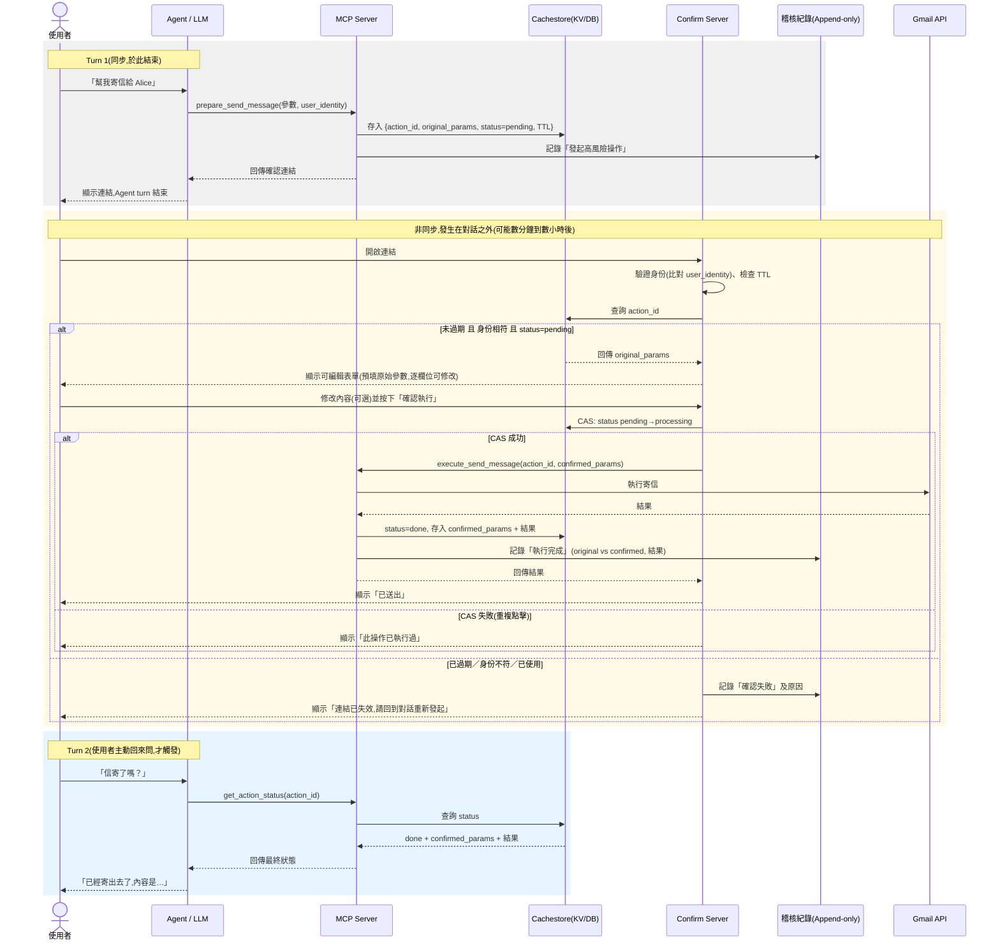

```mermaid
sequenceDiagram
    actor User as 使用者
    participant LLM as Agent / LLM
    participant MCP as MCP Server
    participant Cache as Cachestore(KV/DB)
    participant Web as Confirm Server
    participant AU as 稽核紀錄(Append-only)
    participant Gmail as Gmail API

    rect rgb(240,240,240)
    Note over User,LLM: Turn 1(同步,於此結束)
    User->>LLM: 「幫我寄信給 Alice」
    LLM->>MCP: prepare_send_message(參數, user_identity)
    MCP->>Cache: 存入 {action_id, original_params, status=pending, TTL}
    MCP->>AU: 記錄「發起高風險操作」
    MCP-->>LLM: 回傳確認連結
    LLM-->>User: 顯示連結,Agent turn 結束
    end

    rect rgb(255,250,230)
    Note over User,Gmail: 非同步,發生在對話之外(可能數分鐘到數小時後)
    User->>Web: 開啟連結
    Web->>Web: 驗證身份(比對 user_identity)、檢查 TTL
    Web->>Cache: 查詢 action_id

    alt 未過期 且 身份相符 且 status=pending
        Cache-->>Web: 回傳 original_params
        Web-->>User: 顯示可編輯表單(預填原始參數,逐欄位可修改)
        User->>Web: 修改內容(可選)並按下「確認執行」

        Web->>Cache: CAS: status pending→processing
        alt CAS 成功
            Web->>MCP: execute_send_message(action_id, confirmed_params)
            MCP->>Gmail: 執行寄信
            Gmail-->>MCP: 結果
            MCP->>Cache: status=done, 存入 confirmed_params + 結果
            MCP->>AU: 記錄「執行完成」(original vs confirmed, 結果)
            MCP-->>Web: 回傳結果
            Web-->>User: 顯示「已送出」
        else CAS 失敗(重複點擊)
            Web-->>User: 顯示「此操作已執行過」
        end
    else 已過期／身份不符／已使用
        Web->>AU: 記錄「確認失敗」及原因
        Web-->>User: 顯示「連結已失效,請回到對話重新發起」
    end
    end

    rect rgb(230,245,255)
    Note over User,LLM: Turn 2(使用者主動回來問,才觸發)
    User->>LLM: 「信寄了嗎？」
    LLM->>MCP: get_action_status(action_id)
    MCP->>Cache: 查詢 status
    Cache-->>MCP: done + confirmed_params + 結果
    MCP-->>LLM: 回傳最終狀態
    LLM-->>User: 「已經寄出去了,內容是…」
    end
```