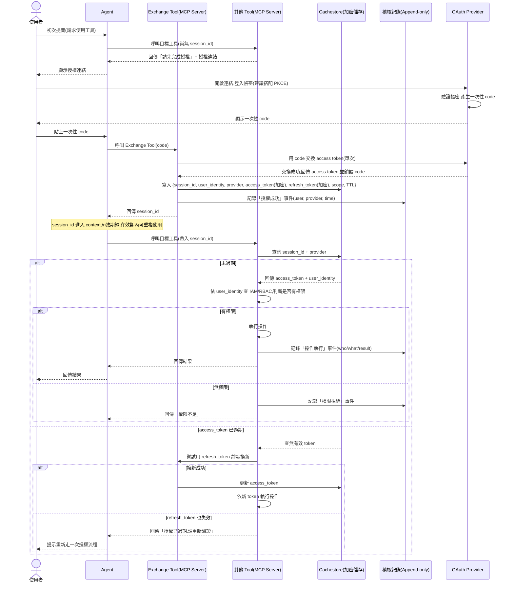

```mermaid
sequenceDiagram
    actor U as 使用者
    participant M as Agent
    participant E as Exchange Tool(MCP Server)
    participant W as 其他 Tool(MCP Server)
    participant D as Cachestore(加密儲存)
    participant AU as 稽核紀錄(Append-only)
    participant A as OAuth Provider

    U->>M: 初次提問(請求使用工具)
    M->>W: 呼叫目標工具(尚無 session_id)
    W-->>M: 回傳「請先完成授權」+ 授權連結
    M-->>U: 顯示授權連結

    U->>A: 開啟連結,登入帳密(建議搭配 PKCE)
    A->>A: 驗證帳密,產生一次性 code
    A-->>U: 顯示一次性 code

    U->>M: 貼上一次性 code
    M->>E: 呼叫 Exchange Tool(code)
    E->>A: 用 code 交換 access token(單次)
    A-->>E: 交換成功,回傳 access token,並銷毀 code

    E->>D: 寫入 {session_id, user_identity, provider, access_token(加密), refresh_token(加密), scope, TTL}
    E->>AU: 記錄「授權成功」事件(user, provider, time)
    E-->>M: 回傳 session_id
    Note over M: session_id 進入 context,\n效期短,在效期內可重複使用

    M->>W: 呼叫目標工具(帶入 session_id)
    W->>D: 查詢 session_id + provider

    alt 未過期
        D-->>W: 回傳 access_token + user_identity
        W->>W: 依 user_identity 查 IAM/RBAC,判斷是否有權限
        alt 有權限
            W->>W: 執行操作
            W->>AU: 記錄「操作執行」事件(who/what/result)
            W-->>M: 回傳結果
            M-->>U: 回傳結果
        else 無權限
            W->>AU: 記錄「權限拒絕」事件
            W-->>M: 回傳「權限不足」
        end
    else access_token 已過期
        D-->>W: 查無有效 token
        W->>E: 嘗試用 refresh_token 靜默換新
        alt 換新成功
            E->>D: 更新 access_token
            W->>W: 依新 token 執行操作
        else refresh_token 也失效
            W-->>M: 回傳「授權已過期,請重新驗證」
            M-->>U: 提示重新走一次授權流程
        end
    end
```